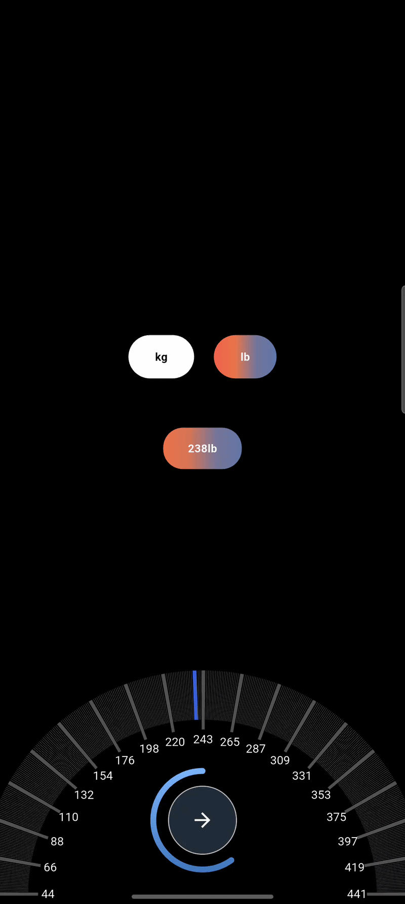
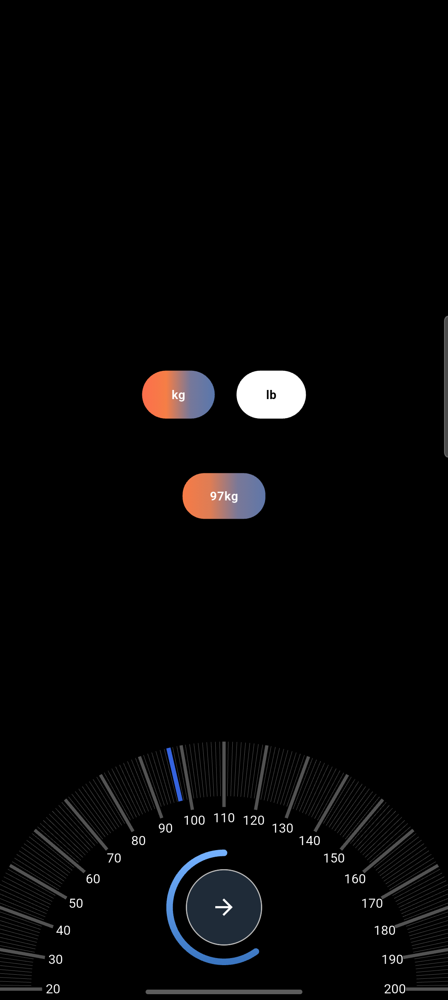
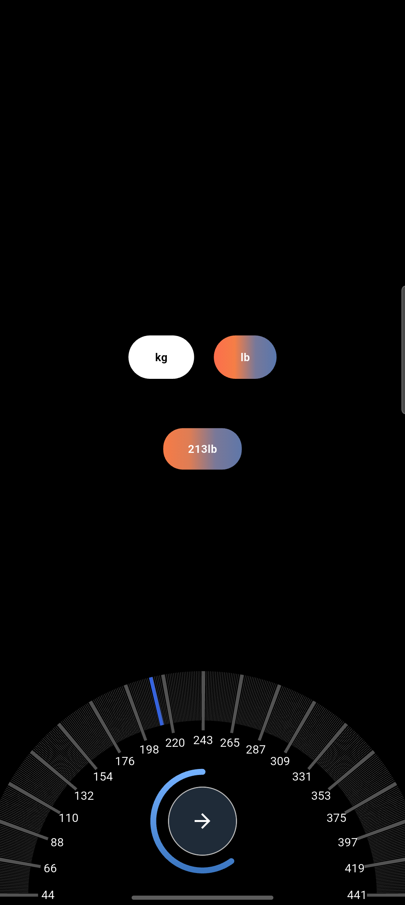

# Weight Dial Picker

A beautiful and customizable weight picker with kg/lb support.

---

## ✨ Features

* 🎯 Smooth dial interaction
* 🔄 kg / lb toggle
* 🎨 Custom UI
* 📱 Easy to use

---

## 📸 Preview (GIF)

<p align="center">
  
</p>

---

## 🖼 Screenshots

<p align="center">
  
  
</p>

---

## 🚀 Usage

```dart
import 'package:weight_dial_picker/weight_dial_picker.dart';

WeightDialPicker(
  initialWeight: 70,
  unit: 'kg',
  onChanged: (value, unit) {
    print("$value $unit");
  },
)
```

---

## 📦 Installation

Add this to your `pubspec.yaml`:

```yaml
dependencies:
  weight_dial_picker: ^0.0.2
```

Then run:

```bash
flutter pub get
```

---

## ⚙️ Parameters

| Parameter     | Type     | Default  | Description                 |
| ------------- | -------- | -------- | --------------------------- |
| minWeight     | double   | 20       | Minimum weight              |
| maxWeight     | double   | 200      | Maximum weight              |
| unit          | String   | 'kg'     | Default unit                |
| initialWeight | double?  | null     | Initial selected value      |
| onChanged     | Function | required | Callback when value changes |

---

## 💡 Example

```dart
WeightDialPicker(
  minWeight: 30,
  maxWeight: 150,
  unit: 'lb',
  initialWeight: 80,
  onChanged: (value, unit) {
    print("Selected: $value $unit");
  },
)
```

---

## 🧑‍💻 Author

Mithlesh Gurjar

---

## 📄 License

MIT License
